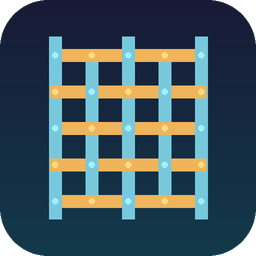
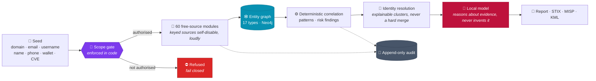

<div align="center">




# Weft

**Free-source OSINT reconnaissance aggregator.**

[](#-what-it-collects)
[](#-what-it-collects)
[](#-develop)
[](#-principles)

[](#-principles)
[](#-local-ai-optional)
[](#-principles)
[](LICENSE)

</div>

Weft is the cross-thread that weaves scattered open-source strands into one fabric. Give it a domain,
email, username, name, phone, crypto address or CVE, and it expands outward across free public
sources, pulling back linked entities and drawing the relationships as a graph.

**One query instead of twenty tabs.**

> [!CAUTION]
> **Authorised use only.** Weft aggregates information about identifiable people from open sources.
> Use it only where you hold explicit authorisation and a lawful basis. It is provided "AS IS",
> without warranty, and the authors accept no liability for misuse. See
> [DISCLAIMER.md](DISCLAIMER.md) for the full terms.

---

## 🧭 How it works



<div align="center">

**Everything above the model is deterministic.** The modules and correlation rules produce the
evidence. The local model only reasons about it.

</div>

## ✨ Features

<table>
<tr><td width="33%" valign="top">

### 🌱 One seed, a whole graph

A domain, email, username, name, phone, crypto address or CVE expands across **60 free-source
modules** into a linked graph of **17 entity types**.

</td><td width="33%" valign="top">

### 🔒 Passive and compliance-gated

Reads public sources only. The operator accepts the terms once (UK GDPR and DPA, EU GDPR, US CFAA),
the scope gate is enforced in code, and every call lands in an append-only audit.

</td><td width="33%" valign="top">

### 🧬 Identity resolution

Clusters the entities that are the same person on shared handles, matching names and a shared PGP
key. Confidence reflects independent corroboration.

</td></tr>
<tr><td valign="top">

### ⚙️ Correlation and risk

Deterministic patterns across the graph, plus high-stakes signals: sanctions matches,
known-exploited CVEs and malicious infrastructure.

</td><td valign="top">

### 📊 Graph analytics

Betweenness centrality finds the best pivot. Community detection groups connected clusters.

</td><td valign="top">

### 🎖️ Admiralty grading

A ranked triage banner, and every entity carries its NATO Admiralty code: source reliability A to F,
information credibility 1 to 6.

</td></tr>
<tr><td valign="top">

### 📤 Reports and export

Markdown, styled HTML and PDF (WeasyPrint). STIX 2.1 and MISP for OpenCTI and MISP interop. A
standalone interactive graph (pyvis) with a legend and risk nodes highlighted, and a KML map of
geolocated points.

</td><td valign="top">

### 🔁 Monitoring

A persisted graph per engagement means a re-run diffs against the last: what is new, what is gone,
what gained confidence.

</td><td valign="top">

### 🖱️ One-click cold start

The desktop icon brings up the stack (Neo4j, SearXNG, Tor) and the local AI, then opens the UI with
live service-status dots.

</td></tr>
</table>

## 🧱 Principles

| | Principle | What it means in practice |
|:--:|---|---|
| 🆓 | **Free sources only** | No paid APIs, ever. Free-tier keys that cost nothing are fine, and every keyed source self-disables, loudly, until its key is present. |
| 👁️ | **Passive only** | Weft reads public indexes and open data. It never attacks, scans, exploits, brute-forces or logs in to a target, and it never touches private data. |
| 🚦 | **Fail closed** | The operator accepts the terms once at launch, recorded with name, version and timestamp. The scope gate then binds every run in code. |
| 🔬 | **Deterministic first** | The modules and correlation rules produce evidence. The local model only reasons about that evidence, and never invents a finding. |
| 📜 | **Append-only audit** | Every module call and gate decision is logged. Purge removes personal data and findings; the audit metadata is retained. |

## 🗂️ What it collects

Every registered module is wired to the run path and health-checked. One that cannot run, whether
from a missing key, a missing binary or an unreachable service, **reports why rather than silently
doing nothing.**

Seventeen entity types flow through the graph: domain, email, username, name, person, organisation,
phone, IP, URL, social profile, address, crypto address, CVE, package, archive snapshot, breach and
image.

<details>
<summary><b>🌐 Domain and infrastructure</b></summary>
<br>

Certificate transparency (crt.sh, certspotter), passive DNS and subdomains (subdomain.center,
HackerTarget), RDAP and WHOIS, ARIN, Common Crawl, Wayback, urlscan, GitHub code and commit search,
and email-auth spoofability (SPF, DMARC, DKIM).

</details>

<details>
<summary><b>🧬 Identity</b></summary>
<br>

GLEIF, Wikidata, Gravatar, Keybase, PGP keyservers, Hacker News, npm, Stack Overflow, Bluesky (AT
Protocol), username enumeration (maigret, sherlock, holehe), and Companies House with its
beneficial-ownership (PSC) register.

</details>

<details>
<summary><b>📍 IP and threat</b></summary>
<br>

Geolocation, RIPEstat, ARIN, Shodan InternetDB (keyless), threat blocklists and malware-filtering DNS
reputation. Threat sources include abuse.ch (ThreatFox, URLhaus) and AbuseIPDB.

</details>

<details>
<summary><b>👤 People and companies</b></summary>
<br>

GDELT (global news), CourtListener (US case law), Crossref (publications), Apple App Store (published
apps), SEC EDGAR, and sanctions screening (OFAC and UN).

</details>

<details>
<summary><b>🪙 Crypto</b></summary>
<br>

Bitcoin (mempool.space, keyless), ENS name and address resolution, Etherscan.

</details>

<details>
<summary><b>🛡️ Vulnerability</b></summary>
<br>

A CVE is enriched with CISA KEV (known-exploited, ransomware use) and OSV. A package (npm, PyPI)
chains through to its CVEs and its maintainers' identities.

</details>

<details>
<summary><b>🔑 Free-key providers</b></summary>
<br>

AbuseIPDB, Hunter.io, SecurityTrails, Etherscan, abuse.ch and more sit behind one pluggable base.
Each self-disables until you add its free key to `.env`, so the keyless core runs out of the box.

</details>

<details>
<summary><b>🧅 Dark web (opt-in)</b></summary>
<br>

A passive Ahmia index search over Tor. Search-only: it never crawls onion content, needs a running
Tor SOCKS proxy, and self-disables otherwise.

</details>

## 🤖 Local AI (optional)

A small local model turns the graph into intelligence **without ever leaving the machine.** It
reasons about the deterministic evidence; it never produces findings.

- **Report narrative.** A concise, factual British-English summary of the graph.
- **Identity assessment.** Judges whether the collected entities belong to one individual, listing
  corroborating signals and conflicts, ending with a confidence band. A labelled inference for a
  human to confirm, never an auto-merge.
- **Grounded.** Any narrative that names an email or URL not in the graph is discarded, so the model
  can summarise but cannot invent.
- **Local-only.** Runs against a local Ollama. A 3B to 8B model is plenty and fits an 8GB GPU.
  Personal data never reaches a hosted model.

## 🚀 Run

```bash
./weft.sh                 # brings up Neo4j, SearXNG, Tor and the local AI, then the UI
./weft.sh --stop          # stop the UI and the stack
```

On Linux desktops the double-clickable `weft.desktop` launcher opens Weft in a frameless Chromium app
window, with live service-status dots, restart and shutdown controls, a one-time terms screen, an
always-visible search form and report downloads. Add free keys in `.env` (see `.env.example`) to
light up the keyed sources.

## 🧪 Develop

```bash
python3.13 -m venv .venv && . .venv/bin/activate
pip install -e ".[dev]"
pytest                    # 310 tests, deterministic and offline
```

## ⚖️ Licence

Proprietary. Copyright © 2026 HuzoSecurity Ltd. All rights reserved. The source is published for
review; running it requires a licence from the Owner.

**Licences are granted on request**, ordinarily for authorised security testing and investigative
work, academic and research use, or evaluation by prospective clients. Write to
**robert@huzosecurity.com** saying who you are, what you intend to use it for, and the lawful basis
for any processing of personal data.

That condition is deliberate. Weft aggregates information about identifiable people from open
sources, and a tool that does that should not be handed to anyone who cannot account for why they
want it. See [LICENSE](LICENSE) and [DISCLAIMER.md](DISCLAIMER.md).

<div align="center">
<sub><b>Owner</b> HuzoSecurity Ltd · <b>Purpose</b> authorised penetration-testing reconnaissance</sub>
</div>
